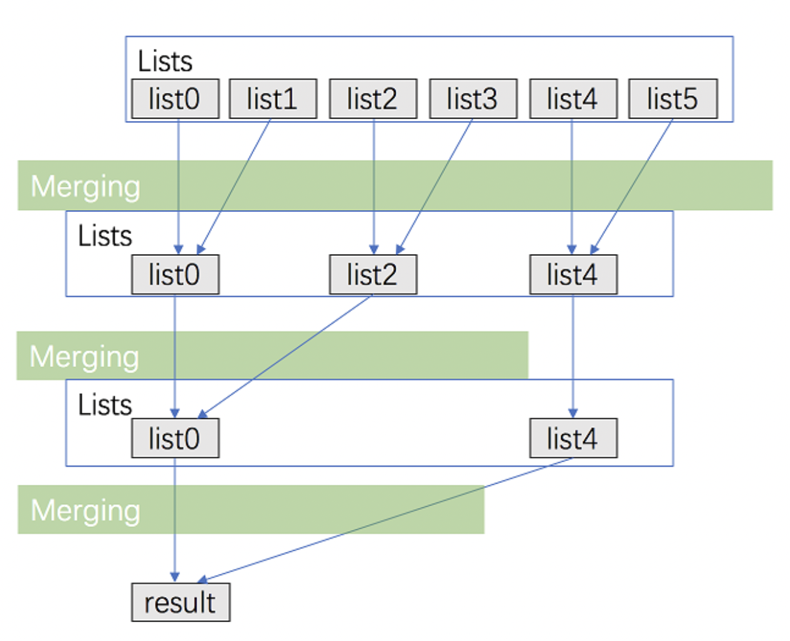

## Merge k Sorted Lists

#### Approach: Merge lists one by one

**Algorithm**

Convert merge}k lists problem to merge 2 lists (k-1) times. 

**Complexity Analysis**

- Time complexity : O(kN) where k is the number of linked lists.
  - We can merge two sorted linked list in O(n) time where n is the total number of nodes in two lists.
  - Sum up the merge process and we can get: equal O*(*k*N*).
- Space complexity : O(1)
  - We can merge two sorted linked list in O(1) space.

#### Approach 2: Merge with Divide And Conquer

**Intuition & Algorithm**

This approach walks alongside the one above but is improved a lot. We don't need to traverse most nodes many times repeatedly

- Pair up k lists and merge each pair.
- After the first pairing, k lists are merged into k/2 lists with average 2N/k length, then k/4, k/8 and so on.
- Repeat this procedure until we get the final sorted linked list.

Thus, we'll traverse almost N nodes per pairing and merging, and repeat this procedure about log(k) times.



```python
class Solution(object):
    def mergeKLists(self, lists):
        """
        :type lists: List[ListNode]
        :rtype: ListNode
        """
        amount = len(lists)
        interval = 1
        while interval < amount:
            for i in range(0, amount - interval, interval * 2):
                lists[i] = self.merge2Lists(lists[i], lists[i + interval])
            interval *= 2
        return lists[0] if amount > 0 else None

    def merge2Lists(self, l1, l2):
        head = point = ListNode(0)
        while l1 and l2:
            if l1.val <= l2.val:
                point.next = l1
                l1 = l1.next
            else:
                point.next = l2
                l2 = l1
                l1 = point.next.next
            point = point.next
        if not l1:
            point.next=l2
        else:
            point.next=l1
        return head.next
```

**Complexity Analysis**

- Time complexity : O(Nlog k) where k is the number of linked lists.
  - We can merge two sorted linked list in O(n) time where n*n* is the total number of nodes in two lists.
  - Sum up the merge process and we can get: *O*(*N*log*k*)
- Space complexity : O(1)
  - We can merge two sorted linked lists in O(1) space.